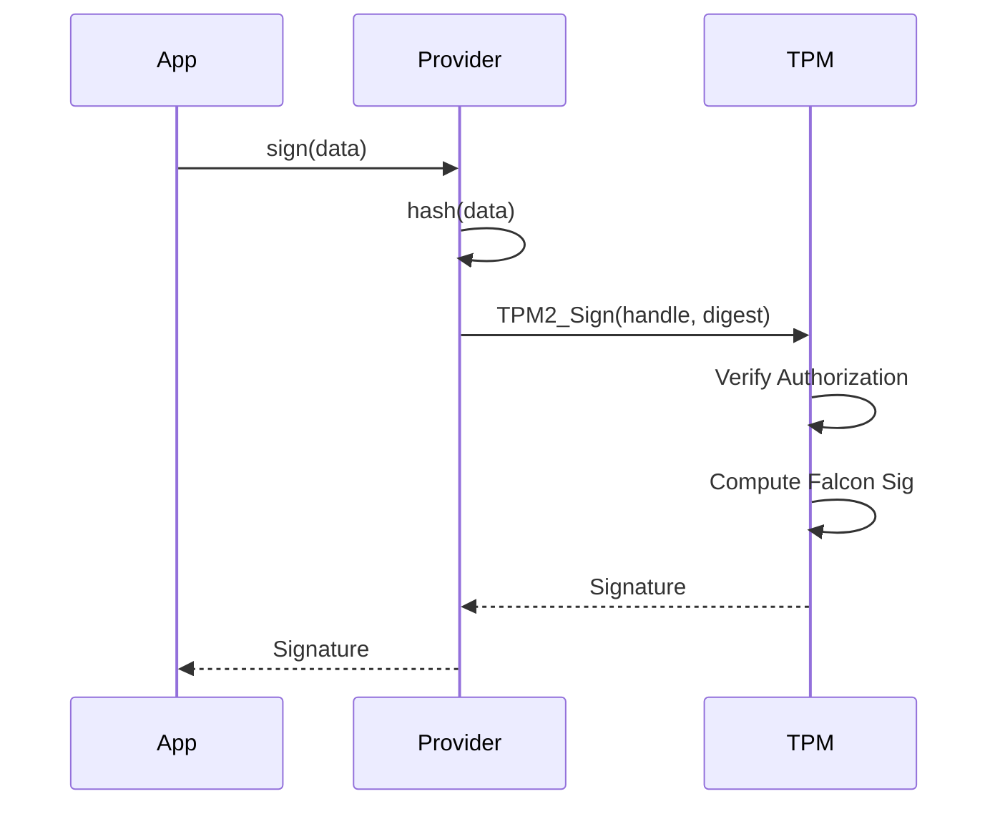

# Hardware Abstraction Layer (HAL) Internals

PQC-IIoT uses a trait-based Abstraction Layer to decouple cryptographic logic from the underlying execution environment. This allows the same high-level application code to run on a standard Linux gateway (using software crypto) and an embedded device with a secure element (TPM/HSM).

## The `SecurityProvider` Trait

The core of the HAL is the `SecurityProvider` trait, defined in `src/security/provider.rs`. It serves as the single point of truth for all sensitive operations.

```rust
pub trait SecurityProvider: Send + Sync {
    // Identity Management
    fn public_keys(&self) -> &PeerKeys;
    
    // Cryptographic Primitives
    fn sign(&self, message: &[u8]) -> Result<Vec<u8>>;
    fn decrypt(&self, capsule: &[u8], ciphertext: &[u8]) -> Result<Vec<u8>>;
    
    // Lifecycle
    fn zeroize(&mut self);
}
```

### Design Principles

1.  **Secret Key Isolation**: The `SecurityProvider` implementation is the *only* component that holds private keys. High-level clients (`SecureMqttClient`) only hold a reference to the provider.
2.  **Thread Safety**: The `Send + Sync` bounds ensure the provider can be shared safely across Tokio tasks or threads.
3.  **Error Propagation**: All fallible operations return a `Result` type that maps hardware-specific errors (e.g., `TPM_E_AUTH_FAIL`) to the library's `Error` enum.

## Reference Implementation: `SoftwareSecurityProvider`

The default implementation uses pure Rust crates (`pqcrypto`, `aes-gcm`) and stores keys in protected memory regions.

### Memory Layout
- **Key Storage**: `Box<dyn SecretKey>` allows polymorphic storage of different algorithm keys (though currently concrete types are used for FFI reasons).
- **Protection**: We use the `zeroize` crate. When the provider is dropped, the memory containing private keys is overwritten with zeros using volatile writes, preventing sensitive data from remaining in the heap.

```rust
// Internals of SoftwareSecurityProvider
struct SoftwareSecurityProvider {
    kyber_sk: zeroize::Zeroizing<Box<[u8]>>, // Auto-zeroize on drop
    falcon_sk: zeroize::Zeroizing<Box<[u8]>>,
    // ...
}
```

## Hardware Provider Architecture (TPM 2.0)

When using a Hardware Security Module (HSM) or TPM:

1.  **Handles vs Keys**: The provider does not store the raw private key. Instead, it stores a handle (e.g., `0x81000001` for a persistent TPM key).
2.  **Off-loading**:
    - `sign(msg)` sends the hash of the message to the TPM via TCG Software Stack (TSS).
    - The TPM performs the signing internally using the restricted key.
    - The signature is returned.
3.  **No Extraction**: The private key never leaves the hardware boundary.

### Integration Flow

